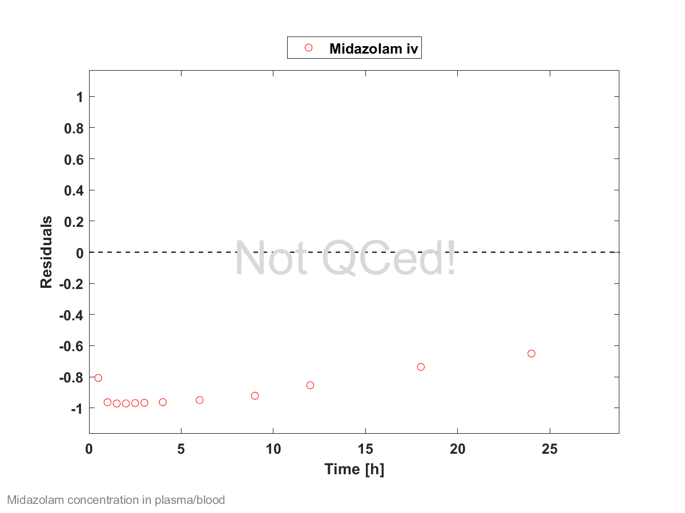
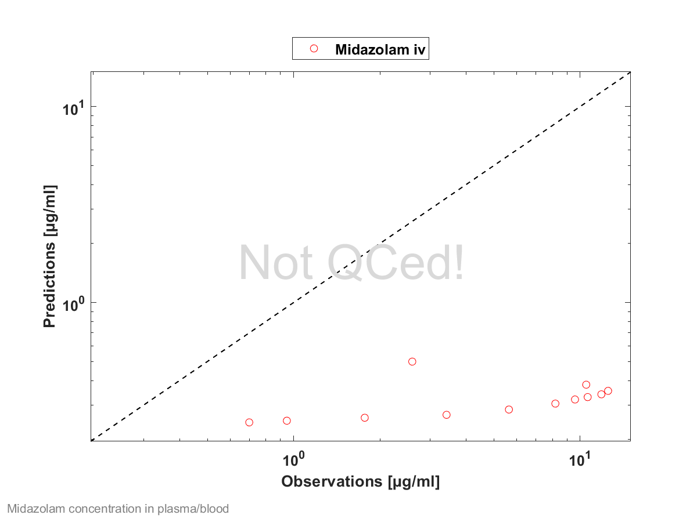

# Chapter 1

Oh there was a sow who had three little pigs,
There little piggies had she.
The old sow always went "oink, oink, oink,"
and the piggies went "wee, wee, wee-ee-ee."     
      
Now one day one of the three little pigs
To the other two piggies said he,
"Why don't we always go oink, oink, oink?
It's so childish to go wee, wee, wee-ee-ee!"    

These three piggies grew skinny and lean,
Skinny they well should be,
For they always would try to go "oink, oink, oink,"
And they wouldn't go "wee, wee, wee-ee-ee."
      
Now there three piggies they up and they died.
A very sad sight to see.
So don't ever try to go "oink, oink, oink,"
When you oughta go "wee, wee, wee-ee-ee!"

14.506243

# Compound: Midazolam

## Parameters

Name                                             | Value          | Value Origin                                      | Alternative  | Default |
------------------------------------------------ | -------------- | ------------------------------------------------- | ------------ | ------- |
Solubility at reference pH                       | 0.049 mg/ml    | Publication-FaSSIF (Heikkinen 2012)               | Measurement  | True    |
Reference pH                                     | 6.5            | Publication-FaSSIF (Heikkinen 2012)               | Measurement  | True    |
Lipophilicity                                    | 3.13 Log Units | Database-Unknown-Drugbank                         | Measurement  | True    |
Fraction unbound (plasma, reference value)       | 0.2            | Parameter Identification-Parameter Identification | Measurement  | True    |
Specific intestinal permeability (transcellular) | 2E-06 dm/min   | Parameter Identification-Parameter Identification | Optimization | True    |
Cl                                               | 1              |                                                   |              |         |
F                                                | 1              |                                                   |              |         |
Is small molecule                                | Yes            |                                                   |              |         |
Molecular weight                                 | 325.77 g/mol   |                                                   |              |         |
Plasma protein binding partner                   | Albumin        |                                                   |              |         |
Enable supersaturation                           | No             |                                                   |              |         |
## Calculation methods

Name                    | Value               |
----------------------- | ------------------- |
Partition coefficients  | Rodgers and Rowland |
Cellular permeabilities | PK-Sim Standard     |
## Processes

### Metabolizing Enzyme: CYP3A4-Optimization

Molecule: CYP3A4
#### Parameters

Name                 | Value        | Value Origin                                      |
-------------------- | ------------ | ------------------------------------------------- |
Enzyme concentration | 1 µmol/l     |                                                   |
Vmax                 | 0 µmol/l/min |                                                   |
Km                   | 2.73 µmol/l  |                                                   |
kcat                 | 13 1/min     | Parameter Identification-Parameter Identification |
### Systemic Process: Glomerular Filtration-GFR

Species: Human
#### Parameters

Name         | Value | Value Origin |
------------ | -----:| ------------: |
GFR fraction |     1 |              |

